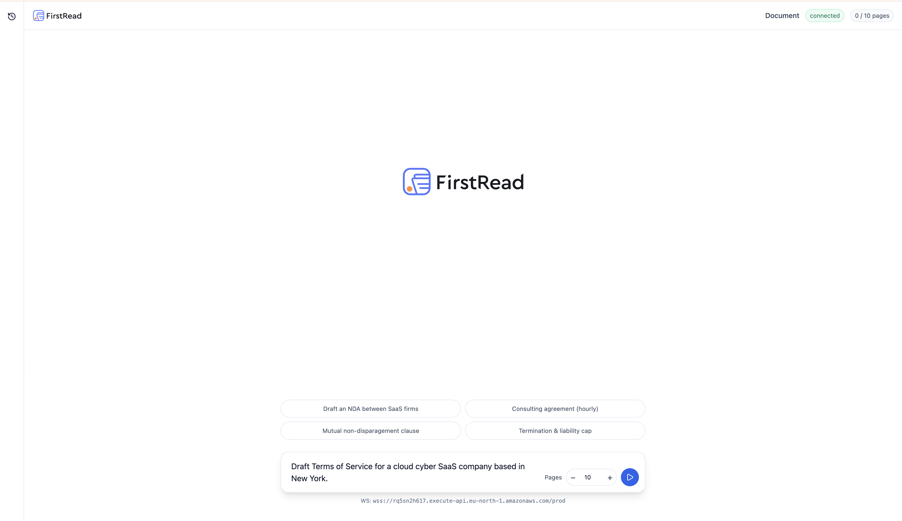
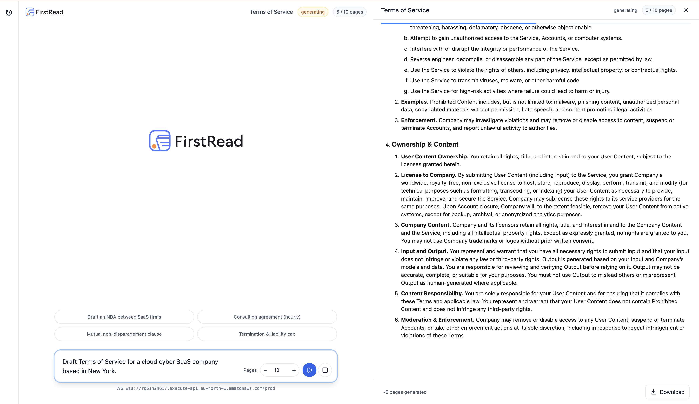
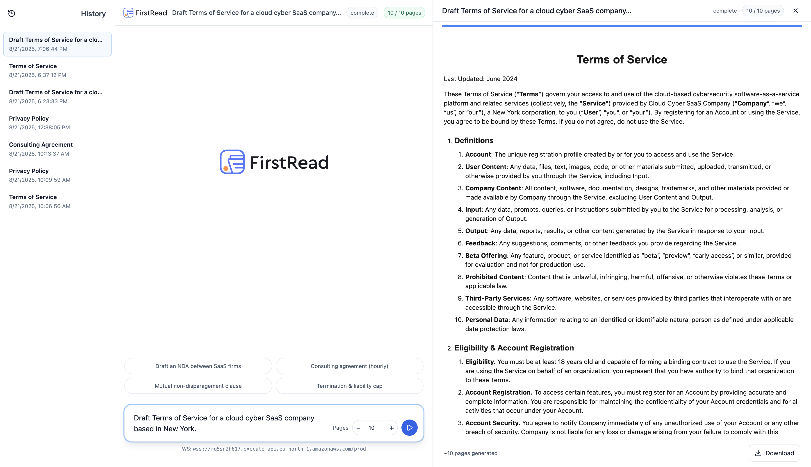

# FirstRead AI Contract Generator

## Overview

FirstRead is an MVP AI-native contract generator. Users can enter a plain language description of their business context, and the system streams back a **production-ready, styled HTML contract** of 10+ pages, aligned to the request.

The app is designed with **real-time streaming**, **AWS serverless scalability**, and **frontend responsiveness** in mind.





---

## Folder Structure

The repository is organized as follows:

```
.
├── backend/                # AWS Lambda + SAM backend
│   ├── src/
│   │   ├── generate.mjs    # Lambda entrypoint for contract generation
│   │   ├── prompts.mjs     # Centralized system prompts for quality/legal structure
│   │   └── ...             # Other backend utilities (helpers, post, etc.)
│   ├── template.yaml       # SAM template (defines Lambda, S3, API Gateway, IAM roles)
│   └── README.md           # Backend-specific notes
│
├── app/                    # Next.js frontend (Vercel-ready)
│   ├── page.js             # Main UI (editor, streaming, history)
│   └── layout.js           # Root layout
│
├── lib/
│   └── ws.js               # WebSocket connection helper
│
├── public/
│   └── logo.svg            # Branding logo
│
├── README.md               # Main project documentation
└── package.json            # Root dependencies and scripts
```

This structure separates backend (serverless AI generation pipeline) from frontend (real-time contract drafting UI).

---

## Features

- **Backend (AWS Lambda via SAM):**
  - Streaming AI completions via OpenAI
  - Contract generation with enforced depth and structure
  - Handles token limits, retries, and presigned S3 links
  - Stores completed contracts in S3
  - API Gateway WebSocket for real-time streaming
  - **Production challenges handled:** token limits, API failures, and latency managed via serverless design and retries
- **Frontend (Next.js):**
  - Minimal, responsive UI with textarea, generate/stop, and preview panel
  - Contract streaming with live pagination
  - History rail with saved contracts (S3 presigned fetch) and stored using local-storage since there is no auth
  - Download button exports contracts directly to **Word (.doc)** format
  - Suggestions grid for common contract types

---

## Page Logic in Backend

One of the **core requirements** is that each generated contract must be **10+ pages**.To achieve this, the backend implements **page logic** that maps token/word counts to pages and enforces exact page boundaries.

- **Words per page:** The backend uses a constant of ~350 words per page (`WORDS_PER_PAGE=350`).
- **Target pages:** By default, the system generates at least **10 pages**, but users can select between 3–40 pages via the UI.
- **Markers:** During streaming, the model is instructed to insert explicit markers (`<!--PAGE_BREAK-->`) between pages.
- **Fallbacks:**
  - If markers are missing, the backend heuristically inserts breaks every ~350 words.
  - If the output is shorter than requested pages, a continuation request (appendices) is triggered.
  - If the output exceeds requested pages, it is trimmed to the target count.
- **Font considerations:** The font size and line spacing are standardized in the backend CSS (`11pt/1.5` for HTML, `10.5pt/1.45` for Word export).
  This ensures that the **350 words per page approximation matches the actual printed/Word layout**, making page counts consistent with the 10+ page requirement.

This ensures contracts are **long enough** to meet legal detail requirements, while respecting the user’s requested length.

---

## AWS SSO Configuration

Before deploying or running the backend, configure AWS SSO with a profile (e.g., `firstread-dev`):

```bash
aws configure sso --profile firstread-dev
```

You’ll be prompted for:

- **SSO start URL**
- **SSO region**
- **Account ID**
- **Role name**
- **CLI profile name** (use `firstread-dev`)

Then login:

```bash
aws sso login --profile firstread-dev
```

This must be done before running `sam build`, `sam deploy`, or `sam logs`.

---

## Deployment

### Backend (SAM)

```bash
cd backend

sam build
sam deploy --guided --profile firstread-dev
```

After deployment, note:

- API Gateway WebSocket endpoint
- S3 bucket name
- Lambda function ARN

These are injected into the frontend via environment variables.

### Frontend (Next.js)

Inside the root directory:

```bash
npm install
npm run dev
```

Set environment variables:

```bash
NEXT_PUBLIC_WS_URL=wss://<your-api-id>.execute-api.<region>.amazonaws.com/<stage>
```

Deployable to Vercel or Amplify.

---

## Usage

1. Open the frontend.
2. Enter a plain language prompt, e.g.:

   ```
   Draft Terms of Service for a cloud cyber SaaS company based in New York
   ```
3. Click **Generate**. The contract streams into the right-hand pane.
4. Use the **Download** button to export as `.doc`.

---

## Architecture

- **Frontend:** Next.js (App Router, client components)
- **Backend:** AWS Lambda (Node.js), API Gateway WebSocket, S3, SSM Parameter Store
- **AI:** OpenAI GPT models with system prompts enforcing structure and consistency

---

## Tradeoffs

- Page count normalization ensures contracts are long enough, but could trim/tail if the model under/overshoots.
- Real-time WebSocket streaming chosen over HTTP for responsiveness.
- Contracts expire in S3 (presigned URLs); users can re-request presigned links from history.

---

## Example

Prompt:

```
Draft terms of service for a cloud cyber SaaS company based in New York
```

Output:

- 10+ page HTML contract
- Section numbering (1., 1.1., 1.1.1…)
- Ownership & Content clauses with depth and examples
- Exportable to Word

---

## Credits

Built as an MVP by Richard Obiri (FirstRead).
